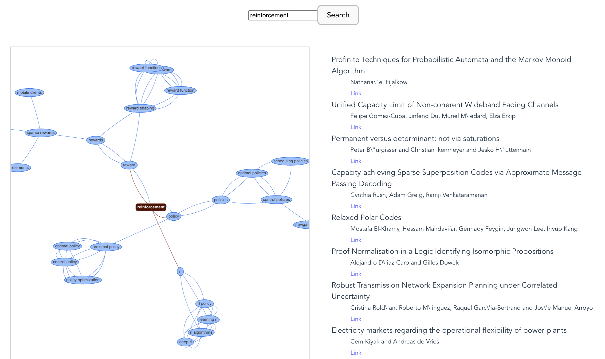
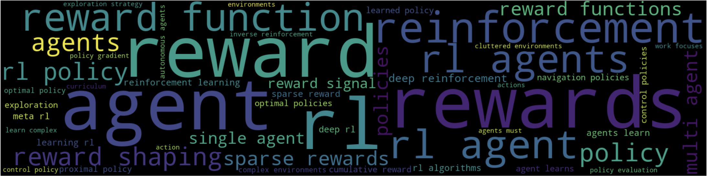
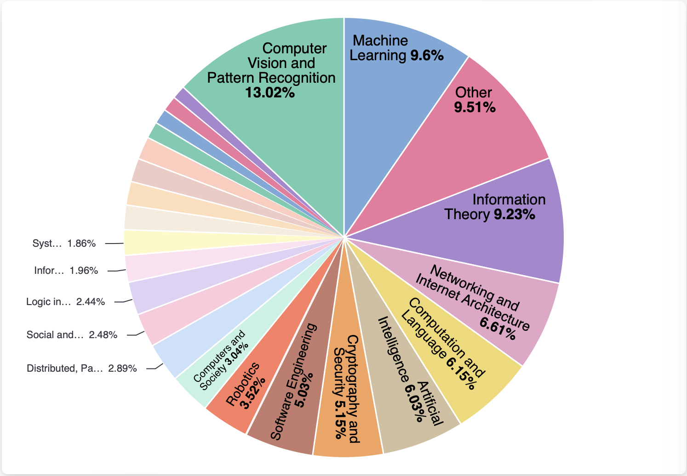

# 💡 Parec

This project is part of the *Data Science for Text Analytics* class of Heidelberg University. 

***
## Team Members
- Jan Kerschbaum; ✉️ [jankerschbaum@web.de](mailto:jankerschbaum@web.de)
- Sandra Friebolin; ✉️ [sandra_friebolin@web.de](mailto:sandra_friebolin@web.de)
- Dilara Aykurt; ✉️ [d.aykurt@web.de](mailto:d.aykurt@web.de)
- Annalena Frey; ✉️ [pf225@stud.uni-heidelberg.de](mailto:pf225@stud.uni-heidelberg.de)

***
## Table of contents
1. [Introduction](#introduction)
1. 🛠️ [Set Up](#set-up)
2. ⚙️  [Usage](#usage)
3. 🎥 [Demo](#demo)
4. 🏯 [Code Structure](#code-structure)
    1. [Backend](#backend)
    2. [Frontend](#frontend)
5. 🗃️ [Data](#data)
6. 💻 [Model Components](#model-components)
7. 📊 [Evaluation](#evaluation)
8. 📝 [Contributions](#contributions)

***
## 🛠️ Introduction <a name="introduction"></a>

Parec is a web application that offers a comprehensive solution for knowledge discovery and research recommendations. By taking in a user query on a particular topic, it quickly generates a knowledge graph of related concepts and recommends the top cientific articles from the [arXiv](https://arxiv.org/) database to match the user's interests. Parec streamlines the process of finding relevant information and provides an innovative solution for researchers and students alike.

The application consists of a backend and a frontend. The backend is responsible for retrieving data from [Elasticsearch](https://www.elastic.co/de/) and providing it to the frontend via a REST API. The frontend is a web application that allows users to search and view recommended articles.


***
## 🛠️ Set Up <a name="setup"></a>

### Prerequisites

To run Parec, you need to have [Docker](https://www.docker.com) and [Docker Compose](https://docs.docker.com/compose/) installed on your system. Here are the necessary commands for Linux:

```bash
# Install Docker
curl -fsSL https://get.docker.com -o get-docker.sh
sudo sh get-docker.sh

# Install Docker Compose
sudo curl -L "https://github.com/docker/compose/releases/download/1.29.2/docker-compose-$(uname -s)-$(uname -m)" -o /usr/local/bin/docker-compose

# Apply executable permissions to the binary
sudo chmod +x /usr/local/bin/docker-compose

# Verify Docker Compose installation
docker-compose --version
```

### Running the Application

1. Clone the repository: `git clone https://github.com/Jan-Kerschbaum/Parec.git`
2. Navigate into the Parec directory: `cd Parec`
3. 🚀 Run the following command to start the application: `docker-compose build` ➡️ `docker-compose up`

⚠️ Please wait before you go to the next step until you see the message:
```bash
frontend  | /docker-entrypoint.sh: Configuration complete; ready for start up
```
This can take some time ⏳

4. Open a web browser and go to http://localhost:80. The frontend should now be running.


ℹ️ All necessary dependencies are indicated in the [requirements.txt](parec-backend/requirements.txt) file.

***
## ⚙️ Usage <a name="usage"></a>

1. Use the search bar to enter a topic you are interested in. (ℹ️ Note that the current version is restricted to topics related to computer science.)
2. Click the `Search` button.

➡️ On the left you'll find a graph of topics and terms related to the one you entered.
➡️ On the right, you find your personal list of recommended papers based on the topic. Click on a link to view the paper on [arXiv](https://arxiv.org/).


***
## 🎥 Demo <a name="demo"></a>




***
## 🏯 Code-Structure <a name="code-structure"></a>

### Backend

The main functionality of the backend is to handle the incoming user queries, retrieve data from Elasticsearch and provide it to the frontend in the desired format. It employs the FastApi and Python-Multipart modules for the frontend to interact with. 

The code in the main code for our application can be found in the [`app`](parec-backend/app) folder, including the endpoints that handle incoming requests and return the relevant responses. The code is further organized into the following directories:

- 🗂️ [`data`](parec-backend/app/data): This directory contains the scripts that are responsible for loading the data from Elasticsearch, transforming it as necessary, and returning it to the application. Further, the code for training the underlying Top2Vec model from the data is also housed here.

- 🗂️ [`src`](parec-backend/app/src): This directory contains the main components of the application, such as the paper recommender that searches through the papers, the file that finds related terms based on a user query and the controller that handles queries.

- 🗂️ [`tests/`](parec-backend/app/tests): This directory contains the test functions for the backend code.


### Frontend
The Parec frontend is a web-based user interface for the Parec application. It allows users to input a query and receive a list of recommended research papers based on the query, as well as a visual representation of the relationships between topics related to the query. It is built using the [Svelte](https://svelte.dev/) framework. Further, [Vis](https://visjs.org/) is used to generate the visual representation of the term graph, and [jQuery](https://jquery.com) for communication between the frontend and backend.

The Parec frontend code is organized into several directories and files, a detailed description can be found in the [parec-frontend](parec-frontend) directory. Some important files are:


- 🗂️ [`src/`](parec-frontend/src): This directory contains the source code for the Parec web application, including JavaScript, TypeScript, HTML, and CSS files that define the frontend logic, layout, and styling of the application, as well as additional assets such as images and fonts:

    - **🌐 [`App.svelte`](parec-frontend/src/App.svelte):** This file is the main component of the Parec frontend web application, which contains the routing logic and renders other components.

    - **🌐 [`main.js`](parec-frontend/src/main.js):** This file is the entry point for the Parec frontend web application, which initializes the root component and attaches it to the DOM.
    
    - **🌐 [`package.json`](parec-frontend/src/package.json):** Contains metadata about the frontend, such as dependencies and scripts for building and running the application.

- **🛳️ [`Dockerfile`](parec-frontend/Dockerfile):** This Dockerfile builds and deploys a frontend application using `Node.js` and `Nginx`, copying over the necessary files and configurations and installing required dependencies in the process.


***
## 🗃️ Data <a name="data"></a>

The dataset we use is provided by [kaggle](https://www.kaggle.com/datasets/Cornell-University/arxiv?resource=download). It contains paper titles, paper abstracts, and their subject categories from [arXiv](https://arxiv.org/).

### Preprocessing

We confine ourselves to papers from the two arxiv computer science and statistics [categories](parec-backend/app/data/preprocessing/categories.json). Due to resource reasons, but also to ensure an up-to-date database for our paper recommender, we only keep papers from the years 2013-2023, resulting in 16127 documents in total.

We further only use certain keys that are relevant for our task, namely `abstract`, `title`, `author`, `year` `category` and `paper_id`. 

✂️ We apply lemmatization and filter out stopwords via [NLTK](https://www.nltk.org/search.html?q=stopwords&check_keywords=yes&area=default) and punctuation via the Python [string](https://docs.python.org/3/library/string.html) module. This helps us improve the quality of our dataset by standardizing the representation of words, reducing the complexity and redundancy of the data, and simplifying the analysis process by reducing the number of unique words.

### Data Point Example


***
## 💻 Model-Components <a name="model-components"></a>

Our application clusters papers using [Top2Vec](https://github.com/ddangelov/Top2Vec)'s topic modeling to limit the search space. At runtime, when a user query is received, we search the dataset for related terms recursively, creating a graph with the terms as nodes. We assign a relevance metric to the terms, with the relevance of a given term declining as we move outwards along the graphs edges from the node representing the user query. We then retrieve potentially relevant candidate papers from our reduced search space and rank them based on the relevance metric. The top candidate papers metadata is sent to the frontend for visualization along with the graph, as defined by its edges. The application also handles edge cases, such as empty queries, initialization errors, or no query being sent (in which case, example data is used).

### 1. 📈 Top2Vec:

[Top2Vec](https://github.com/ddangelov/Top2Vec) is a topic modeling algorithm that uses a shared embedding for phrases and documents to generate topic vectors on a given corpus. It starts by training an embedding model on the corpus and then clusters the embedded vectors to generate topic vectors. The number of topics is not specified beforehand but is instead inferred from the data. Top2Vec is known for its ability to handle large datasets efficiently and is especially useful for document clustering and topic exploration tasks.

We train Top2Vec on the abstracts in our dataset and set `ngram_vocab=True` in order to add phrases to our topic descriptions. E.g. related terms for the topic `reinfocement learning` are the following:



In total, Top2Vec clusters our abstracts into 133 topics.


### 2. 📃 Paper Recommender:
Our paper search algorithm utilizes our term graph based on the Top2Vec model to generate a comprehensive search of all papers. By calculating relevance based on a precomputed relevance metric, the algorithm returns the top 10 papers for a given search query in a relatively efficient manner.


### 3. 🔎 Elasticsearch:

Elasticsearch is a powerful search and analytics engine that is often used as a data store for applications. It is designed to store, search, and analyze large volumes of data quickly and in near real-time. Elasticsearch provides a RESTful API that enables you to search and retrieve data in a variety of ways. We use it to store our data and use [Kibana](https://www.elastic.co/de/kibana/) for visualizations: 



### 4. 🌐 Svelte:

The Parec application uses [Svelte](https://svelte.dev/) to create the user interface for the web application. Svelte is a front-end JavaScript framework that allows developers to create reactive and dynamic user interfaces by compiling the application code to highly optimized vanilla JavaScript code.


***
## 📊 Evaluation <a name="evaluation"></a>

We perform two types of evaluation:

1. We evaluate our model against a random baseline. 

2. We also perform a qualitative evaluation where we subjectively assess our results. To do this, one team member entered 5 different search queries and sent the top three recommended abstract links to another team member. This team member then went through the abstracts and noted the most relevant terms. These terms were then compared to those provided by the Parec application in the knowledge graph for each query.


***
## 📝 Contributions <a name="contributions"></a>

Jan Kerschbaum was primarily involved in the development of both the frontend and backend components of the Parec project, while Dilara Auykurth was responsible setting up a Docker configuration. Sandra Friebolin was in charge of managing the Elasticsearch database, pre-processing data, and writing README files, and Annalena Frey focused on testing and script writing for our video presentation. All team members shared responsibilities for evaluating and documenting the project, ensuring that the work is thoroughly and accurately documented for future reference.