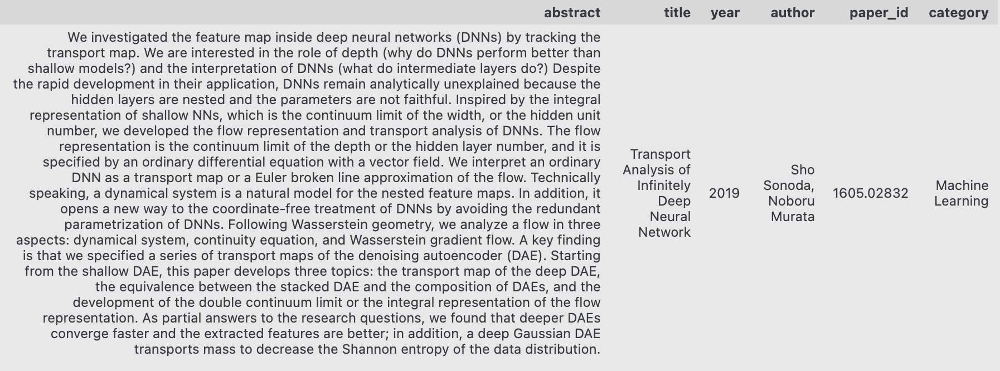

# 💡 Parec

This project is part of the *Data Science for Text Analytics* class of Heidelberg University. 

***
## Team Members
- Jan Kerschbaum; ✉️ [jankerschbaum@web.de](mailto:jankerschbaum@web.de)
- Sandra Friebolin; ✉️ [sandra_friebolin@web.de](mailto:sandra_friebolin@web.de)
- Dilara Aykurt; ✉️ [d.aykurt@web.de](mailto:d.aykurt@web.de)
- Annalena Frey; ✉️ [pf225@stud.uni-heidelberg.de](mailto:pf225@stud.uni-heidelberg.de)

***
## Table of contents
1. [Introduction](#introduction)
1. 🛠️ [Set Up](#set-up)
2. ⚙️  [Usage](#usage)
3. 🏯 [Code Structure](#code-structure)
    1. [Backend](#backend)
    2. [Frontend](#frontend)
4. 🗃️ [Data](#data)
5. 💻 [Pipeline](#pipeline)

***
## 🛠️ Introduction 

Parec is a web application that offers a comprehensive solution for knowledge discovery and research recommendations. By taking in a user query on a particular topic, it quickly generates a knowledge graph of related concepts and recommends the top cientific articles from the [arXiv](https://arxiv.org/) database to match the user's interests. Parec streamlines the process of finding relevant information and provides an innovative solution for researchers and students alike.

The application consists of a backend and a frontend. The backend is responsible for retrieving data from [Elasticsearch](https://www.elastic.co/de/) and providing it to the frontend via a REST API. The frontend is a web application that allows users to search and view recommended articles.

***
## 🛠️ Set Up 

### Prerequisites

To run Parec, you need to have Docker and Docker Compose installed on your system.

### Running the Application

1. Clone the repository: `git clone https://github.com/Jan-Kerschbaum/Parec.git`
2. Navigate into the Parec directory: `cd Parec`
3. 🚀 Run the following command to start the application: `docker-compose build` ➡️ `docker-compose up`
4. Open a web browser and go to http://localhost:9200. The frontend should now be running.

***
## ⚙️ Usage 

1. Use the search bar to enter a topic you are interested in. (ℹ️ Note that the current version is restricted to topics related to computer science.)
2. Click the `Search` button.
2. On the right, you find recommended papers based on your topic. Click on a link to view the paper on [arXiv](https://arxiv.org/).

***
## 🏯 Code-Structure 

### Backend

The main functionality of the backend is to handle the incoming user queries, retrieve data from Elasticsearch and provide it to the frontend in the desired format. It employs the FastApi and Python-Multipart modules for the frontend to interact with. 

The code in the main code for our application can be found in the [`app`](parec-backend/app) folder, including the endpoints that handle incoming requests and return the relevant responses. The code is further organized into the following directories:

- 🗂️ [`data`](parec-backend/app/data): This directory contains the scripts that are responsible for loading the data from Elasticsearch, transforming it as necessary, and returning it to the application.

- 🗂️ [`src`](parec-backend/app/src): This directory contains the main components of the application, such as the paper recommender that searches through the papers, the file that finds related terms based on a user query and the controller that handles queries.

- 🗂️ [`tests/`](parec-backend/app/tests): This directory contains the test functions for the backend code.

### Frontend

The Parec frontend is a web-based user interface for the Parec application. It allows users to input a query and receive a list of recommended research papers based on the query, as well as a visual representation of the relationships between topics related to the query. It is built using [Svelte](https://svelte.dev/), with additional libraries for data visualization such as [JQuery](https://jquery.com/) and [Vis](https://visjs.org/). It communicates with the backend using HTTP requests to receive search results and topic data.

The Parec frontend code is organized into several directories and files, a detailed description can be found in the [parec-frontend](parec-frontend) directory. Some important files are:

%%%%%%%%- `public/`: This directory contains the public assets for the frontend, such as the index.html file and the favicon.

- 🗂️ [`src/`](parec-frontend/src): This directory contains the source code for the Parec web application, including JavaScript, TypeScript, HTML, and CSS files that define the frontend logic, layout, and styling of the application, as well as additional assets such as images and fonts:

    - **🌐 [`App.svelte`](parec-frontend/src/App.svelte):** This file is the main component of the Parec frontend web application, which contains the routing logic and renders other components.

    - **🌐 [`main.js`](parec-frontend/src/main.js):** This file is the entry point for the Parec frontend web application, which initializes the root component and attaches it to the DOM.
    
    - **🌐 [`package.json`](parec-frontend/src/package.json):** Contains metadata about the frontend, such as dependencies and scripts for building and running the application.

- **🛳️ [`Dockerfile`](parec-frontend/Dockerfile):** This Dockerfile builds and deploys a frontend application using `Node.js` and `Nginx`, copying over the necessary files and configurations and installing required dependencies in the process.

ℹ️ All necessary dependencies are indicated in the [requirements.txt](parec-backend/requirements.txt) file.

***
## 🗃️ Data 

The dataset we use is provided by [kaggle](https://www.kaggle.com/datasets/Cornell-University/arxiv?resource=download). It contains paper titles, paper abstracts, and their subject categories from [arXiv](https://arxiv.org/).

### Preprocessing

Due to resource reasons, we confine ourselves to papers from computer science [categories](parec-backend/app/data/cs_categories.json) from the years 2016-2022, resulting in 11932 documents.

We further only use certain keys that are relevant for our task, namely `abstract`, `title`, `author`, `year` `category` and `paper_id`. We do not apply further preprocessing of the abstracts, in order to keep subtextual relations between the words intact and because our topic model, Top2Vec, we will filter out stopwords by default. It further performs lemmatization to reduce words to their base form, which can help with topic modeling.

### Data Point Example

***
## 💻 Pipeline 

Our application clusters papers using [Top2Vec](https://github.com/ddangelov/Top2Vec)'s topic modeling to limit the search space. At runtime, when a user query is received, we search the dataset for related terms recursively, creating a graph of related terms. We assign a relevance metric to each term, declining as we move outwards from the node representing the user query. We then retrieve potentially relevant candidate papers from our reduced search space and rank them based on the relevance metric. The top candidate papers, along with their metadata, are sent to the frontend for visualization along with the graph defined by its edges. The application also handles error cases, such as empty queries, initialization errors, or no query being sent (in which case, example data is used).

**📈 Top2Vec:**

Top2Vec is a topic modeling algorithm that uses word embeddings to generate topic vectors for a given corpus. It starts by training a word embedding model on the corpus and then clusters the word embeddings to generate topic vectors. The number of topics is not specified beforehand but is instead inferred from the data. Top2Vec is known for its ability to handle large datasets efficiently and is especially useful for document clustering and topic exploration tasks.

**📃 Paper Recommender:**
Our paper search algorithm utilizes Top2Vec's term graph to generate a comprehensive search of all papers. By calculating relevance based on a precomputed relevance metric, the algorithm efficiently returns the top 10 papers for a given search query.

**🔎 Elasticsearch:**

Elasticsearch is a powerful search and analytics engine that is often used as a data store for applications. It is designed to store, search, and analyze large volumes of data quickly and in near real-time. Elasticsearch provides a RESTful API that enables you to search and retrieve data in a variety of ways.

